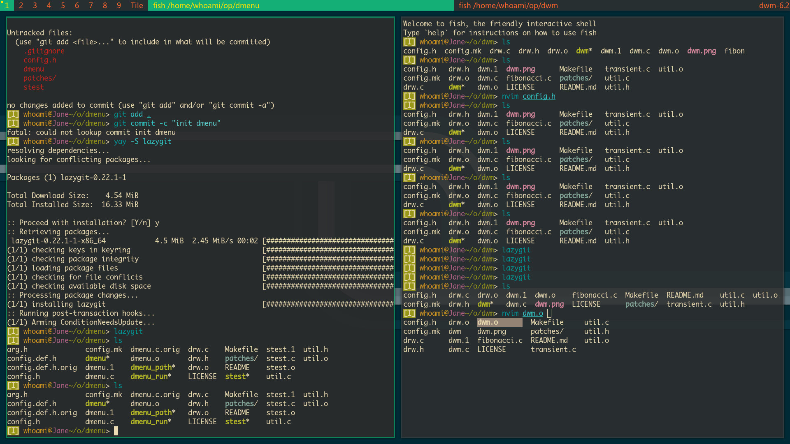
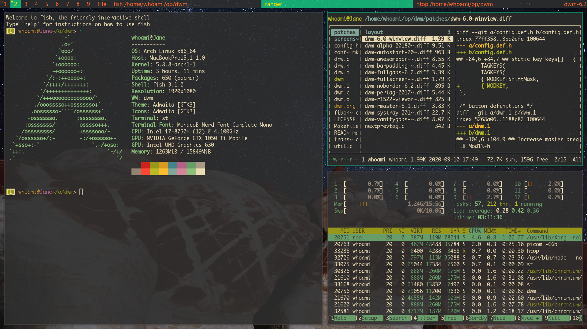

## dwm - dynamic window manager
- dwm is an extremely fast, small, and dynamic window manager for X.


## Requirements
- In order to build dwm you need the Xlib header files.


### Installation
- Edit config.mk to match your local setup (dwm is installed into the /usr/local namespace by default).

- Afterwards enter the following command to build and install dwm (if necessary as root):

- `make clean install`


## Running dwm

### Xinitrc

- Add the following line to your .xinitrc to start dwm using startx:

- `exec dwm`

- In order to connect dwm to a specific display, make sure that
the DISPLAY environment variable is set correctly, e.g.:

- `DISPLAY=foo.bar:1 exec dwm`

- (This will start dwm on display :1 of the host foo.bar.)

- In order to display status info in the bar, you can do something
- like this in your .xinitrc:
```
while xsetroot -name "`date` `uptime | sed 's/.*,//'`"
do
	sleep 1
done &
exec dwm
```
### Lightdm (Login manager)

- If you compiled and installed dwm from source keeping the defaults, its executable has to be in `/usr/local/bin`.
- Create a new .desktop file in `/usr/share/xsessions/`:
- `sudo vim /usr/share/xsessions/dwm.desktop`
- and paste the following content in it:
```
[Desktop Entry]
Encoding=UTF-8
Name=dwm
Comment=dwm window manager
Exec=/usr/local/bin/dwm
Type=Application
```

- Then you have to logout and choose dwm for your session in your display manager

## Configuration
- The configuration of dwm is done by creating a custom config.h and (re)compiling the source code.
- Shortcuts are in config.h, and able to config

## SCREENSHOTS



## TODO
- Preparing remove awesomebar patch
- combine dwmblock
